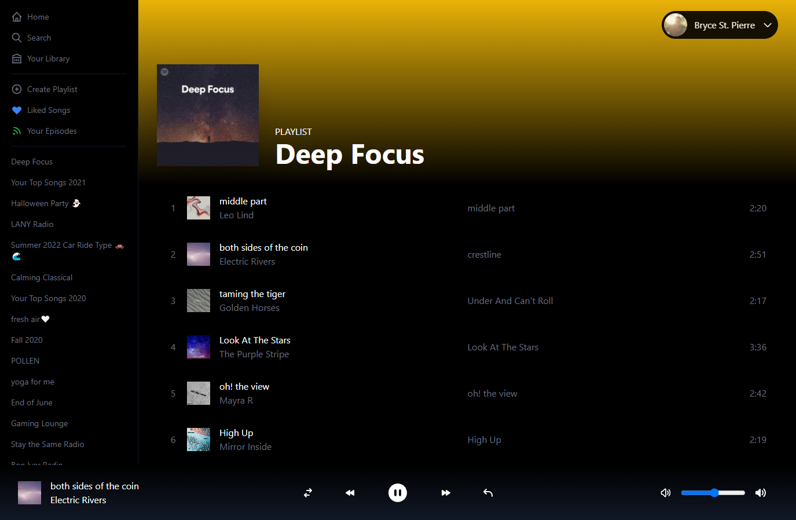

# Spotify Clone

A Spotify clone built using Next.js, TailwindCSS, React hooks, and the Spotify API.

Built following along a YouTube tutorial, but also including some of my own improvements and bug fixes.

## Setup

This app uses the Spotify API which acts more as a remote for an active device running Spotify.

A Spotify account is required, as well as a device running the Spotify app.

1. Create an application at [Spotify for Developers](https://developer.spotify.com/) and copy your Client ID and Client Secret.
2. Change the `Redirect URIs` setting for the application to include `http://localhost:3000/api/auth/callback/spotify`.
3. Clone the repo.
4. Copy the `.env.example` to `.env.local`.
5. Fill in the environment variables.
6. Bump some tunes! 🎧

## Future Improvements

- Investigate Spotify API issue with skipping songs.
- Optimize images from `` to `Next/Image` components.
- Style the front end to match the UI even closer.
